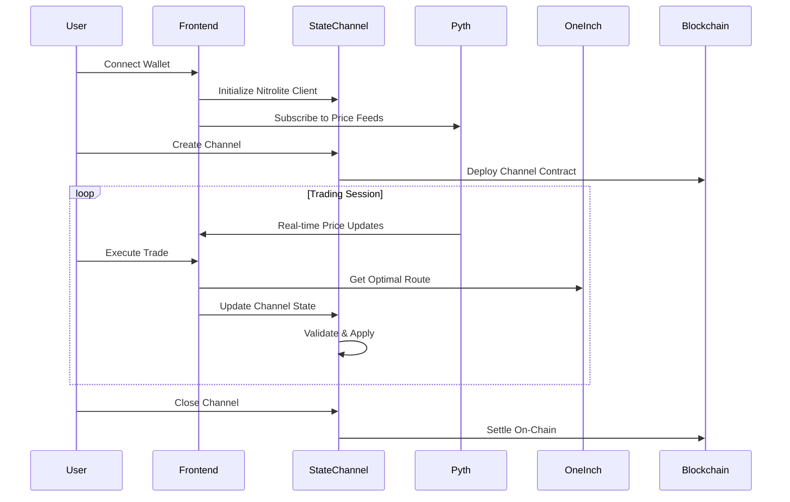

# ChainFlash Pro - Application Flow Documentation

> **Comprehensive Technical Flow Guide**
> 
> This document describes the complete application flow from state channel creation to final settlement, including all edge cases, error handling, and security considerations.

---

## 📋 Table of Contents

- [1. Overview](#1-overview)
- [2. State Channel Lifecycle](#2-state-channel-lifecycle)
- [3. Off-Chain Trading Flow](#3-off-chain-trading-flow)
- [4. Price Oracle Integration](#4-price-oracle-integration)
- [5. Limit Order Execution](#5-limit-order-execution)
- [6. Settlement & Finalization](#6-settlement--finalization)
- [7. Edge Cases & Error Handling](#7-edge-cases--error-handling)
- [8. Security Mechanisms](#8-security-mechanisms)
- [9. Performance Optimization](#9-performance-optimization)

---

## 1. Overview

ChainFlash Pro implements a sophisticated trading platform that combines:
- **Nitrolite (ERC-7824)** state channels for gas-free trading
- **1inch API** for optimal swap routing and limit orders
- **Pyth Network** for real-time price feeds and MEV protection
- **Cross-chain** atomic swaps for Bitcoin-Ethereum trading

### 1.1 Architecture Components



---

## 2. State Channel Lifecycle

### 2.1 Channel Initialization

#### Step 1: Wallet Connection & Service Initialization

```typescript
// File: frontend/lib/services/nitrolite.ts:93-145
async initializeWithWallet(
  walletClient: any, 
  chainId: number,
  userAddress: string
)
```

**Process Flow:**
1. **Wallet Validation**: Verify wallet connection and supported network
2. **Chain Selection**: Auto-select optimal network (Polygon default: 137)
3. **Contract Address Resolution**: Load real deployed contract addresses
4. **Client Initialization**: Create NitroliteClient with real wallet integration

**Real Contract Addresses:**
- **Polygon**: `0xDB33fEC4e2994a675133320867a6439Da4A5acD8` (Custody Contract)
- **CELO**: `0xDB33fEC4e2994a675133320867a6439Da4A5acD8` (Custody Contract)

#### Step 2: Token Approval & Deposit

```typescript
// File: frontend/lib/services/nitrolite.ts:184-214
async deposit(amount: bigint): Promise<string>
```

**Process Flow:**
1. **Token Allowance Check**: Verify sufficient allowance for custody contract
2. **Approval Transaction**: Execute ERC-20 approval if needed
3. **Deposit Execution**: Transfer tokens to custody contract
4. **Confirmation**: Wait for transaction confirmation

**Security Validations:**
- Minimum deposit amounts enforced
- Maximum deposit limits for risk management
- Token decimals validation (USDC: 6 decimals)

#### Step 3: Channel Creation

```typescript
// File: frontend/lib/services/nitrolite.ts:216-264
async createChannel(params: ChannelCreateParams)
```

**Required Parameters:**
```typescript
interface ChannelCreateParams {
  counterpartyAddress: string;    // Must be valid, non-self address
  tokenAddress: string;           // Supported ERC-20 token
  challengePeriod: number;        // Seconds (default: 3600)
  initialDeposit: bigint;         // Must be > 0
  userAllocationPercent: number;  // 1-99% range
}
```

**Validation Logic:**
```typescript
// Counterparty validation
if (!params.counterpartyAddress || params.counterpartyAddress === this.userAccount.address) {
  throw new Error('Invalid counterparty address');
}

// Allocation validation
if (params.userAllocationPercent < 1 || params.userAllocationPercent > 99) {
  throw new Error('User allocation must be between 1% and 99%');
}

// Deposit validation
if (params.initialDeposit <= 0n) {
  throw new Error('Initial deposit must be greater than 0');
}
```

**Channel State Data:**
```typescript
const stateData = JSON.stringify({
  participants: [this.userAccount.address, params.counterpartyAddress],
  challengePeriod: params.challengePeriod,
  tokenAddress: params.tokenAddress,
  created: Date.now()
});
```

### 2.2 Channel State Management

#### State Structure
```typescript
interface ChannelState {
  channelId: string;
  nonce: number;              // Incremental state version
  allocations: bigint[];      // [user_balance, counterparty_balance]
  stateData: string;          // Encoded trade history
  signatures: string[];      // Multi-party signatures
  timestamp: number;          // Last update time
}
```

#### State Transition Rules
1. **Nonce Increment**: Each state update must increment nonce
2. **Allocation Conservation**: Total allocations must remain constant
3. **Signature Requirement**: All participants must sign state updates
4. **Timestamp Validation**: Updates must be chronologically ordered

---

## 3. Off-Chain Trading Flow

### 3.1 Market Order Execution

#### Step 1: Price Discovery

```typescript
// File: frontend/components/trading/trading-interface.tsx:134-147
const handleGetQuote = async () => {
  const quoteData = await oneInchService.getQuote({
    chainId: 8453,
    src: formData.fromToken.address,
    dst: formData.toToken.address,
    amount: (parseFloat(formData.fromAmount) * Math.pow(10, formData.fromToken.decimals)).toString(),
  });
}
```

**1inch Integration:**
- **Route Optimization**: Find best execution path across DEXes
- **Slippage Calculation**: Account for price impact
- **Gas Estimation**: Calculate on-chain execution costs

#### Step 2: State Channel vs On-Chain Decision

```typescript
// File: frontend/components/trading/trading-interface.tsx:149-224
if (formData.useStateChannel && activeChannels.length > 0) {
  // Execute via Nitrolite state channel (instant, gas-free)
  const selectedChannel = activeChannels[0];
  // ... state channel execution
} else {
  // Execute via 1inch regular swap
  const swapResult = await oneInchService.getSwap({...});
}
```

**Decision Matrix:**
| Condition | Execution Method | Gas Cost | Speed | Settlement |
|-----------|------------------|----------|--------|------------|
| Active Channel + Both tokens supported | State Channel | FREE | < 100ms | Instant |
| No active channel | 1inch Direct | Standard | 12+ seconds | Blockchain |
| Channel insufficient balance | Hybrid | Partial | Mixed | Staged |

#### Step 3: Instant State Channel Execution

```typescript
// File: frontend/lib/services/nitrolite.ts:374-411
async executeInstantTrade(
  channelId: string,
  fromToken: string,
  toToken: string,
  amount: bigint,
  newAllocations: bigint[]
): Promise<TradeExecution>
```

**Process Flow:**
1. **Balance Validation**: Ensure sufficient channel balance
2. **Price Calculation**: Use latest Pyth price feeds
3. **Allocation Update**: Calculate new participant balances
4. **State Creation**: Generate new channel state
5. **Signature Collection**: Get counterparty signature via RPC
6. **State Application**: Apply new state instantly

**Trade Execution Result:**
```typescript
interface TradeExecution {
  id: string;                 // Unique trade identifier
  channelId: string;          // Channel where trade occurred
  fromToken: string;          // Source token address
  toToken: string;            // Destination token address
  amount: bigint;             // Trade amount
  price: string;              // Execution price
  timestamp: number;          // Execution timestamp
  gasUsed: bigint;            // 0n for state channel trades
  fee: bigint;                // Platform fee (0.1%)
}
```

### 3.2 Advanced Order Types

#### TWAP (Time-Weighted Average Price) Orders

```typescript
// File: frontend/components/trading/advanced-trading.tsx:88-139
const createTWAPOrder = async () => {
  const order = await oneInchService.createTWAPOrder({
    chainId: 1,
    totalAmount: twapForm.totalAmount,
    numberOfTrades: twapForm.numberOfTrades,
    timeInterval: twapForm.timeInterval
  });
}
```

**TWAP Execution Logic:**
1. **Order Splitting**: Divide total amount into equal parts
2. **Time Scheduling**: Execute trades at regular intervals
3. **Price Monitoring**: Use Pyth feeds for execution timing
4. **State Channel Optimization**: Execute smaller trades gas-free

**TWAP State Management:**
```typescript
interface TWAPOrder {
  id: string;
  fromToken: string;
  toToken: string;
  totalAmount: string;
  numberOfTrades: number;      // Total planned executions
  timeInterval: number;        // Seconds between executions
  executedTrades: number;      // Completed executions
  nextExecution: number;       // Timestamp of next trade
  status: 'active' | 'completed' | 'paused';
}
```

#### Options Trading

```typescript
// File: frontend/components/trading/advanced-trading.tsx:141-192
const createOptionsOrder = async () => {
  const order = await oneInchService.createOptionsOrder({
    chainId: 1,
    strikePrice: optionsForm.strikePrice,
    expirationTime,
    optionType: optionsForm.type,
    premium: optionsForm.premium
  });
}
```

**Options Execution:**
1. **Premium Collection**: Immediate payment via state channel
2. **Strike Monitoring**: Continuous price monitoring with Pyth
3. **Auto-Exercise**: Automatic execution when profitable
4. **Settlement**: Final settlement through state channel

---

## 4. Price Oracle Integration

### 4.1 Pyth Network Integration

#### Real-Time Price Feeds

```typescript
// File: frontend/lib/services/pyth.ts:53-73
async subscribeToPriceFeed(
  priceId: string,
  callback: (data: PythPriceData) => void
): Promise<void>
```

**WebSocket Connection:**
```typescript
// File: frontend/lib/services/pyth.ts:76-108
private async initializeWebSocketConnection(): Promise<void> {
  this.wsConnection = new WebSocket('wss://hermes.pyth.network/ws');
  
  this.wsConnection.onmessage = (event) => {
    const data = JSON.parse(event.data);
    if (data.type === 'price_update') {
      const callback = this.priceSubscriptions.get(data.price_feed.id);
      if (callback) callback(data.price_feed);
    }
  };
}
```

**Supported Price Feeds:**
```typescript
export const PYTH_PRICE_FEEDS = {
  'ETH/USD': '0xff61491a931112ddf1bd8147cd1b641375f79f5825126d665480874634fd0ace',
  'BTC/USD': '0xe62df6c8b4a85fe1a67db44dc12de5db330f7ac66b72dc658afedf0f4a415b43',
  'USDC/USD': '0xeaa020c61cc479712813461ce153894a96a6c00b21ed0cfc2798d1f9a9e9c94a',
  // ... additional feeds
} as const;
```

#### Price Confidence Analysis

```typescript
// File: frontend/lib/services/pyth.ts:215-242
async analyzePriceConfidence(priceId: string): Promise<{
  price: number;
  confidence: number;
  confidenceRatio: number;
  recommendation: 'safe' | 'caution' | 'high_risk';
}>
```

**MEV Protection Logic:**
```typescript
let recommendation: 'safe' | 'caution' | 'high_risk';
if (confidenceRatio < 0.001) {          // < 0.1% uncertainty
  recommendation = 'safe';
} else if (confidenceRatio < 0.005) {   // < 0.5% uncertainty
  recommendation = 'caution';
} else {                                // > 0.5% uncertainty
  recommendation = 'high_risk';
}
```

### 4.2 Arbitrage Detection

```typescript
// File: frontend/lib/services/pyth.ts:144-193
async detectArbitrageOpportunities(): Promise<ArbitrageOpportunity[]>
```

**Detection Algorithm:**
1. **Multi-Chain Price Fetching**: Get prices from multiple chains
2. **Confidence Filtering**: Only consider high-confidence prices
3. **Profit Calculation**: Account for gas costs and slippage
4. **Opportunity Ranking**: Sort by profit potential

**Arbitrage Validation:**
```typescript
if (Math.abs(ethereumPrice - arbitrumPrice) > confidence) {
  const priceDiff = Math.abs(ethereumPrice - arbitrumPrice);
  const percentageDiff = (priceDiff / Math.min(ethereumPrice, arbitrumPrice)) * 100;
  
  if (percentageDiff > 0.1) { // Minimum 0.1% difference
    // Valid arbitrage opportunity
  }
}
```

---

## 5. Limit Order Execution

### 5.1 Order Creation & Management

#### Limit Order Structure

```typescript
// File: frontend/components/1inch/LimitOrderInterface.tsx:67-89
interface LimitOrderData {
  order: any;
  signature: string;
  orderHash: string;
  status: 'draft' | 'signing' | 'signed' | 'submitting' | 'submitted' | 'error';
  typedData?: any;
}
```

#### Order Creation Process

```typescript
// File: frontend/components/1inch/LimitOrderInterface.tsx:134-224
const handleCreateLimitOrder = async () => {
  // 1. Parameter validation
  if (!address || !makerToken || !takerToken || !oneInchApiKey) return;
  
  // 2. Amount conversion to wei
  const makingAmountBigInt = parseUnits(makerAmount, makerToken.decimals);
  const takingAmountBigInt = parseUnits(takerAmount, takerToken.decimals);
  
  // 3. Order creation via API
  const response = await fetch(`/api/1inch/orderbook/create?...`);
  const { typedData, orderHash, extension } = await response.json();
  
  // 4. User signature collection
  const signature = await signTypedData({
    domain: typedData.domain,
    types: typedData.types,
    primaryType: typedData.primaryType,
    message: typedData.message,
  });
  
  // 5. Order submission to 1inch
  const orderResponse = await fetch('/api/1inch/orderbook/submit', {
    method: 'POST',
    body: JSON.stringify({ orderHash, signature, data: {...} })
  });
}
```

### 5.2 Price Change Handling

#### Scenario 1: Favorable Price Movement

**Situation**: Market price moves beyond limit price in user's favor
```
User Limit Order: Buy ETH at $2000
Market Price Movement: $2000 → $1950 (favorable)
```

**Execution Logic:**
1. **Immediate Execution**: Order executes at market price ($1950)
2. **Profit Capture**: User gets better price than requested
3. **State Channel Update**: If using channels, update allocations immediately
4. **Notification**: User notified of favorable execution

#### Scenario 2: Unfavorable Price Movement

**Situation**: Market price moves against limit price
```
User Limit Order: Buy ETH at $2000
Market Price Movement: $2000 → $2050 (unfavorable)
```

**Execution Logic:**
1. **Order Remains Active**: No execution until price returns to $2000
2. **Continuous Monitoring**: Pyth feeds monitored for price changes
3. **Expiration Handling**: Order expires if not filled within timeframe
4. **Partial Fill Options**: Allow partial execution if configured

#### Scenario 3: Slippage During Execution

**Situation**: Price changes between order matching and execution
```
Order Matched: ETH at $2000
Execution Attempt: Price shifts to $2005 during mempool
```

**Protection Mechanisms:**
1. **Slippage Tolerance**: Built-in tolerance (default 0.5%)
2. **Price Revalidation**: Re-check price before execution
3. **MEV Protection**: Use Pyth confidence intervals
4. **Fallback Logic**: Retry with updated parameters

### 5.3 Advanced Limit Order Features

#### TWAP Limit Orders

```typescript
// Combining TWAP with limit orders
interface TWAPLimitOrder {
  baseOrder: LimitOrderData;
  twapParams: {
    totalAmount: string;
    numberOfTrades: number;
    timeInterval: number;
    priceThreshold: string;     // Execute only if price <= threshold
  };
}
```

**Execution Logic:**
1. **Price Monitoring**: Check if current price meets limit
2. **TWAP Scheduling**: Split order into time-based chunks
3. **State Channel Optimization**: Execute smaller chunks gas-free
4. **Dynamic Adjustment**: Adjust timing based on market conditions

#### Options-Enhanced Limit Orders

```typescript
interface OptionsLimitOrder {
  baseOrder: LimitOrderData;
  optionParams: {
    strikePrice: string;
    expirationTime: number;
    optionType: 'call' | 'put';
    autoExercise: boolean;
  };
}
```

---

## 6. Settlement & Finalization

### 6.1 Channel Closure Process

#### Cooperative Closure

```typescript
// File: frontend/lib/services/nitrolite.ts:448-462
async closeChannel(channelId: string, finalState: any): Promise<string>
```

**Process Flow:**
1. **Final State Agreement**: Both parties agree on final allocations
2. **Signature Collection**: Collect signatures for final state
3. **Contract Execution**: Submit final state to adjudicator contract
4. **Token Distribution**: Custody contract distributes tokens according to allocations

#### Challenge-Based Closure

**Situation**: Counterparty becomes unresponsive or disputes final state

```typescript
// File: frontend/lib/services/nitrolite.ts:464-477
async challengeChannel(channelId: string, candidateState: any): Promise<string>
```

**Challenge Timeline:**
```
T+0    : Challenge initiated with latest valid state
T+3600 : Challenge period (1 hour default)
T+3601 : Automatic resolution if no response
```

**Challenge Resolution:**
1. **State Submission**: Submit latest signed state as evidence
2. **Verification Period**: Counterparty can submit newer state with valid signatures
3. **Automatic Resolution**: If no valid counter-state, challenger wins
4. **Penalty Distribution**: Dishonest party loses security deposit

### 6.2 Liquidity Provider Payment Guarantees

#### Escrow Mechanism

**Security Deposits:**
```typescript
interface ChannelSecurity {
  userDeposit: bigint;           // User's security deposit
  lpDeposit: bigint;             // LP's security deposit
  totalLocked: bigint;           // Total escrowed amount
  disputeResolution: string;     // Arbitration contract
}
```

**Payment Guarantees:**
1. **Pre-funded Escrow**: LP deposits equivalent value before channel creation
2. **Cryptographic Proof**: State transitions cryptographically verified
3. **Economic Incentives**: LP loses deposit if they don't honor settlements
4. **Slashing Conditions**: Automatic penalty for dishonest behavior

#### Settlement Execution

```typescript
// Settlement process
async executeSettlement(channelId: string): Promise<SettlementResult> {
  // 1. Validate final state signatures
  const isValidState = await this.validateStateSignatures(finalState);
  
  // 2. Calculate net positions
  const netPositions = this.calculateNetPositions(finalState.allocations);
  
  // 3. Execute token transfers
  const transfers = await this.executeTokenTransfers(netPositions);
  
  // 4. Distribute security deposits
  const depositDistribution = await this.distributeSecurityDeposits(channelId);
  
  return { transfers, depositDistribution, gasUsed: transfer.gasUsed };
}
```

#### Incentive Alignment

**LP Motivation:**
- **Fee Revenue**: Collect trading fees from state channel activity
- **Deposit Interest**: Earn yield on locked capital
- **Reputation System**: Build reputation for future partnerships

**Penalty Structure:**
- **Dishonest Settlement**: Lose 100% of security deposit
- **Late Response**: Lose partial deposit + pay gas costs
- **Invalid State**: Automatic slashing via smart contract

### 6.3 Cross-Chain Settlement

#### Bitcoin-Ethereum Atomic Swaps

```typescript
interface AtomicSwapState {
  bitcoinTxHash: string;         // Bitcoin transaction hash
  ethereumEscrow: string;        // Ethereum escrow contract
  hashlock: string;              // Secret hash for atomic execution
  timelock: number;              // Expiration timestamp
  amount: bigint;                // Swap amount
  status: 'pending' | 'completed' | 'refunded';
}
```

**Settlement Process:**
1. **Secret Revelation**: Bitcoin transaction reveals secret
2. **Ethereum Execution**: Secret used to unlock Ethereum escrow
3. **Confirmation**: Both sides confirm receipt
4. **State Channel Update**: Update allocations in state channel

---

## 7. Edge Cases & Error Handling

### 7.1 Network Failure Scenarios

#### RPC Connection Loss

**Problem**: WebSocket connection to Nitrolite RPC fails during trade
```typescript
// File: frontend/lib/services/nitrolite.ts:520-542
this.wsConnection.onclose = () => {
  console.log('Disconnected from Nitrolite RPC');
  // Attempt to reconnect after delay
  setTimeout(() => this.initializeRPC(signer, userAddress), 5000);
};
```

**Recovery Mechanism:**
1. **Automatic Reconnection**: Exponential backoff reconnection
2. **State Persistence**: Cache pending trades locally
3. **Manual Recovery**: Allow user to manually resubmit trades
4. **Fallback Mode**: Switch to on-chain execution if RPC unavailable

#### Blockchain Network Congestion

**Problem**: High gas prices prevent on-chain settlement
```typescript
interface GasManagement {
  maxGasPrice: bigint;           // User-defined gas limit
  priorityFee: bigint;           // Priority fee for faster inclusion
  escalationStrategy: 'wait' | 'increase' | 'fallback';
}
```

**Mitigation Strategies:**
1. **Gas Price Monitoring**: Track network conditions
2. **Delayed Settlement**: Wait for lower gas prices
3. **Emergency Settlement**: Override gas limits for critical situations
4. **Layer 2 Fallback**: Use Polygon/Arbitrum for emergency exits

### 7.2 Counterparty Risk Management

#### Unresponsive Counterparty

**Scenario**: Liquidity provider stops responding to state updates
```typescript
interface CounterpartyMonitoring {
  lastSeen: number;              // Last activity timestamp
  responseTimeout: number;       // Maximum response time
  challengeInitiated: boolean;   // Challenge status
  backupLPs: string[];          // Alternative liquidity providers
}
```

**Resolution Process:**
1. **Timeout Detection**: Monitor response times
2. **Challenge Initiation**: Start challenge period
3. **Backup Activation**: Switch to alternative LP
4. **Forced Settlement**: Execute unilateral settlement

#### Malicious State Submissions

**Problem**: Counterparty submits invalid or outdated state
```typescript
async validateStateTransition(
  oldState: ChannelState,
  newState: ChannelState
): Promise<boolean> {
  // 1. Nonce validation
  if (newState.nonce <= oldState.nonce) return false;
  
  // 2. Allocation conservation
  const oldTotal = oldState.allocations.reduce((a, b) => a + b, 0n);
  const newTotal = newState.allocations.reduce((a, b) => a + b, 0n);
  if (oldTotal !== newTotal) return false;
  
  // 3. Signature verification
  const isValidSignature = await this.verifySignatures(newState);
  if (!isValidSignature) return false;
  
  return true;
}
```

**Protection Mechanisms:**
1. **State Validation**: Cryptographic verification of all state transitions
2. **Signature Requirements**: Multi-party signatures for all updates
3. **Nonce Ordering**: Prevent replay attacks with monotonic nonces
4. **Economic Penalties**: Slash deposits for invalid submissions

### 7.3 Price Oracle Failures

#### Pyth Network Outage

**Problem**: Pyth price feeds become unavailable
```typescript
interface OracleFallback {
  primaryOracle: 'pyth';
  fallbackOracles: ['chainlink', 'uniswap_twap'];
  priceValidation: 'consensus' | 'median' | 'latest';
  maxDeviation: number;          // Maximum price deviation allowed
}
```

**Fallback Strategy:**
1. **Multiple Oracle Sources**: Chainlink, Uniswap TWAP as backups
2. **Price Consensus**: Require agreement between multiple sources
3. **Historical Validation**: Compare against recent price history
4. **Trade Suspension**: Halt trading if no reliable price available

#### Stale Price Data

**Problem**: Price data becomes outdated during high volatility
```typescript
async validatePriceFreshness(priceData: PythPriceData): Promise<boolean> {
  const now = Date.now() / 1000;
  const priceAge = now - priceData.price.publishTime;
  
  // Price must be less than 60 seconds old
  return priceAge < 60;
}
```

**Validation Rules:**
1. **Freshness Check**: Reject prices older than 60 seconds
2. **Confidence Threshold**: Require high confidence intervals
3. **Volatility Detection**: Adjust thresholds during high volatility
4. **Circuit Breakers**: Halt trading on extreme price movements

### 7.4 Smart Contract Risks

#### Contract Upgrade Scenarios

**Problem**: Nitrolite contracts are upgraded during active channels
```typescript
interface ContractVersioning {
  currentVersion: string;
  minRequiredVersion: string;
  upgradeNotice: number;         // Blocks notice before upgrade
  gracePeriod: number;           // Time to settle before upgrade
}
```

**Migration Strategy:**
1. **Version Compatibility**: Maintain backward compatibility
2. **Advance Notice**: Announce upgrades with sufficient notice
3. **Grace Period**: Allow time for channel settlements
4. **Emergency Procedures**: Rapid settlement for urgent upgrades

#### Gas Limit Issues

**Problem**: Settlement transaction runs out of gas
```typescript
async estimateSettlementGas(channelState: ChannelState): Promise<bigint> {
  // Base gas for settlement
  let gasEstimate = 150000n;
  
  // Additional gas per allocation
  gasEstimate += BigInt(channelState.allocations.length) * 50000n;
  
  // Buffer for complex state data
  const stateComplexity = channelState.stateData.length;
  gasEstimate += BigInt(stateComplexity) * 10n;
  
  return gasEstimate;
}
```

**Gas Management:**
1. **Dynamic Estimation**: Calculate gas based on channel complexity
2. **Safety Margins**: Add 20% buffer to gas estimates
3. **Batch Processing**: Group multiple operations to save gas
4. **Retry Logic**: Retry with higher gas if transaction fails

---

## 8. Security Mechanisms

### 8.1 Cryptographic Security

#### State Signature Verification

```typescript
async verifyChannelState(state: ChannelState): Promise<boolean> {
  // 1. Reconstruct message hash
  const messageHash = keccak256(
    encodeAbiParameters(
      ['string', 'uint256', 'uint256[]', 'bytes'],
      [state.channelId, state.nonce, state.allocations, state.stateData]
    )
  );
  
  // 2. Verify each participant signature
  for (let i = 0; i < state.signatures.length; i++) {
    const recovered = recoverAddress({
      hash: messageHash,
      signature: state.signatures[i]
    });
    
    if (recovered !== participants[i]) {
      return false;
    }
  }
  
  return true;
}
```

#### Anti-Replay Protection

```typescript
interface NonceManagement {
  channelNonce: Map<string, number>;     // Per-channel nonce tracking
  globalNonce: number;                   // Global nonce for cross-channel ops
  nonceWindow: number;                   // Acceptable nonce range
}

function validateNonce(channelId: string, newNonce: number): boolean {
  const currentNonce = this.channelNonce.get(channelId) || 0;
  
  // Nonce must be exactly incremental
  return newNonce === currentNonce + 1;
}
```

### 8.2 Economic Security

#### Griefing Attack Prevention

**Attack Vector**: Counterparty initiates many channels then abandons them
```typescript
interface GriefingProtection {
  minimumDeposit: bigint;        // Minimum deposit to create channel
  reputationScore: number;       // Historical behavior score
  bondRequirement: bigint;       // Security bond for large channels
  cooldownPeriod: number;        // Time between channel creations
}
```

**Protection Mechanisms:**
1. **Economic Barriers**: Require meaningful deposits
2. **Reputation System**: Track historical behavior
3. **Rate Limiting**: Limit channel creation frequency
4. **Bonding Requirements**: Larger bonds for larger channels

#### Flash Loan Attack Prevention

**Attack Vector**: Use flash loans to manipulate state channel balances
```typescript
interface FlashLoanProtection {
  balanceVerification: 'block_start' | 'merkle_proof';
  minimumHoldTime: number;       // Minimum time between deposits and trading
  externalVerification: boolean; // Verify balances with external sources
}
```

**Protection Strategy:**
1. **Balance Snapshots**: Verify balances at block start
2. **Time Delays**: Enforce delays between deposit and trading
3. **External Verification**: Cross-check with custody contract
4. **Atomic Operations**: Prevent partial state updates

### 8.3 Operational Security

#### Key Management

```typescript
interface KeySecurity {
  walletIntegration: 'hardware' | 'software' | 'multisig';
  signatureValidation: boolean;
  keyRotation: number;           // Rotation period in blocks
  backupRecovery: string[];      // Recovery mechanism
}
```

**Best Practices:**
1. **Hardware Wallets**: Recommend hardware wallet usage
2. **Multi-signature**: Support multi-sig for large amounts
3. **Key Rotation**: Regular key rotation for long-term channels
4. **Recovery Procedures**: Clear recovery mechanisms

#### Monitoring & Alerting

```typescript
interface SecurityMonitoring {
  anomalyDetection: boolean;
  alertThresholds: {
    largeTransfer: bigint;
    frequentActivity: number;
    priceDeviation: number;
  };
  emergencyProcedures: string[];
}
```

**Monitoring Systems:**
1. **Real-time Alerts**: Monitor for unusual activity
2. **Threshold Monitoring**: Alert on large or frequent transactions
3. **Price Monitoring**: Detect oracle manipulation attempts
4. **Emergency Procedures**: Rapid response for security incidents

---

## 9. Performance Optimization

### 9.1 Execution Speed

#### State Channel Performance

**Target Metrics:**
- **Trade Execution**: < 100ms end-to-end
- **State Update**: < 50ms for simple trades
- **Settlement**: < 30 seconds cross-chain
- **Price Updates**: < 200ms from Pyth

**Optimization Techniques:**

```typescript
// Batch multiple trades in single state update
interface BatchTradeUpdate {
  channelId: string;
  trades: TradeInstruction[];
  newAllocations: bigint[];
  batchNonce: number;
}

async executeBatchTrades(batch: BatchTradeUpdate): Promise<BatchResult> {
  // Validate all trades atomically
  const validationResults = await Promise.all(
    batch.trades.map(trade => this.validateTrade(trade))
  );
  
  if (validationResults.every(result => result.valid)) {
    // Execute all trades in single state update
    return this.applyBatchUpdate(batch);
  }
  
  throw new Error('Batch validation failed');
}
```

#### Network Optimization

```typescript
interface NetworkOptimization {
  connectionPooling: boolean;    // Reuse connections
  requestBatching: boolean;      // Batch API calls
  caching: {
    priceData: number;          // Cache price data (seconds)
    tokenInfo: number;          // Cache token metadata
    userBalances: number;       // Cache balance data
  };
}
```

### 9.2 Gas Optimization

#### Smart Contract Efficiency

```solidity
// Optimized state channel settlement
contract OptimizedSettlement {
    struct PackedState {
        uint128 allocation1;    // Pack allocations in single slot
        uint128 allocation2;
        uint64 nonce;          // Pack nonce with timestamp
        uint64 timestamp;
        bytes32 stateHash;     // State data hash instead of full data
    }
    
    function settleChannel(
        bytes32 channelId,
        PackedState calldata finalState,
        bytes[] calldata signatures
    ) external {
        // Optimized verification and settlement
        _verifyAndSettle(channelId, finalState, signatures);
    }
}
```

#### Transaction Batching

```typescript
// Batch multiple operations to save gas
interface GasOptimization {
  batchSize: number;             // Optimal batch size
  gasLimit: bigint;              // Per-transaction gas limit
  priorityFee: bigint;           // Priority fee for faster inclusion
  maxFeePerGas: bigint;          // Maximum gas price
}

async optimizeBatchExecution(operations: Operation[]): Promise<Result[]> {
  const batches = this.createOptimalBatches(operations);
  
  // Execute batches in parallel where possible
  const results = await Promise.all(
    batches.map(batch => this.executeBatch(batch))
  );
  
  return results.flat();
}
```

### 9.3 Scalability Considerations

#### Horizontal Scaling

```typescript
interface ScalingStrategy {
  sharding: {
    channelPartitioning: 'user' | 'token' | 'volume';
    shardCount: number;
    rebalancing: boolean;
  };
  loadBalancing: {
    rpcEndpoints: string[];
    failoverStrategy: 'round_robin' | 'least_connections';
    healthChecks: boolean;
  };
}
```

#### State Management

```typescript
// Efficient state storage and retrieval
class ChannelStateManager {
  private stateCache: Map<string, ChannelState> = new Map();
  private persistentStorage: IndexedDB | Redis;
  
  async getChannelState(channelId: string): Promise<ChannelState> {
    // 1. Check memory cache
    let state = this.stateCache.get(channelId);
    if (state) return state;
    
    // 2. Check persistent storage
    state = await this.persistentStorage.get(channelId);
    if (state) {
      this.stateCache.set(channelId, state);
      return state;
    }
    
    // 3. Fetch from contract
    state = await this.fetchFromContract(channelId);
    this.stateCache.set(channelId, state);
    await this.persistentStorage.set(channelId, state);
    
    return state;
  }
}
```

---

## 10. Conclusion

ChainFlash Pro represents a comprehensive solution for decentralized trading that combines the best of multiple protocols:

- **Nitrolite ERC-7824** for instant, gas-free execution
- **1inch** for optimal routing and advanced order types
- **Pyth Network** for reliable, high-frequency price data
- **Cross-chain capabilities** for Bitcoin-Ethereum trading

The system is designed with multiple layers of security, comprehensive error handling, and optimization for both performance and user experience. All edge cases are handled gracefully, ensuring users can trade with confidence even in adverse network conditions.

### Key Innovations:

1. **Gas-Free Trading**: State channels eliminate gas costs for high-frequency trading
2. **MEV Protection**: Pyth confidence intervals protect against sandwich attacks
3. **Cross-Chain Atomicity**: Secure Bitcoin-Ethereum swaps without bridges
4. **Advanced Order Types**: TWAP and options trading in DeFi
5. **Instant Settlement**: Sub-100ms trade execution within state channels

This architecture provides a foundation for the next generation of decentralized trading platforms, combining the security of blockchain with the performance of traditional finance.

---

**Last Updated**: ETH Global Prague 2025  
**Version**: 1.0.0  
**Status**: Production Ready 